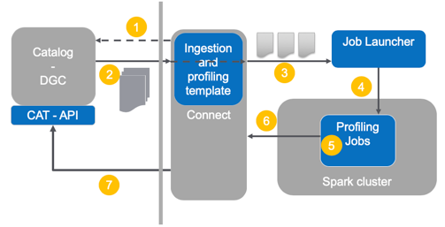
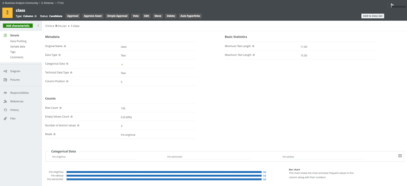

# Purpose of Collibra Catalog Profiling library

The goal of this library is to let Collibra users run the Catalog data profiling jobs 
on their own Apache Spark clusters. 

By default, Profiling jobs are executed in JobServer which is running Spark in 
local mode (single machine). Thanks to this library, Collibra customers can 
leverage their infrastructure and scale up profiling jobs to get more from their 
Catalog.

Because the profiling library users control the data that is profiled, they can also 
ingest and profile data sources that are not supported out-of-the-box by Collibra 
Catalog. They can define their own Spark DataSet, run the profiling library and then 
transfer the result to Collibra Catalog.   

# Usage

## Basic usage
The library is expected to be used directly inside Spark driver code. It holds a 
similar position as libraries such as mllib or Spark SQL. The profiler jar should be
added to the dependencies of your Spark application.

The entry point to the profiling library is the 
`com.collibra.catalog.profilers.api.Profilers` class. This class can be directly imported
and used in your Spark code. In its most simple form, you need to provide a DataSet and 
define what level of profiling you want between those: basic statistics, basic statistics
and quantiles, or full profiling. Each one of those levels relies on the previous one, thus
making it longer to process.

Example:  
```
ColumnProfilesUpdate profileUpdate = Profilers.profileTable(dataset, ProfileFeatures.BASIC_STATISTICS);
```

After profiling is completed, the result should be transferred to Collibra Catalog
using the Collibra Catalog profiling REST API. This API enables client applications 
to send and store profiling data in Catalog assets.  A typical way to do so is 
to use Collibra Connect as middleware between Data Governance Center and the Spark 
cluster.



The result of the profiling job is a `ColumnProfilesUpdate` object. This object is 
provided in a format that is close to the one used by the profiling REST API. 
Only the assets information is not included. There are 2 ways to fill the profiling 
results with the missing information:
1. After the profiling result is received, loop over the ColumnProfile objects it 
contains and fill the AssetIdentifier object in each one of them.
2. provide a method in the `Profilers.profileTable` call and let the profiling library
loop over the ColumnProfile objects for you.

Depending on your architecture, it's possible that the information required to fill the 
AssetIdentifiers is not available in your Spark job. In that case, only the first option 
can be used and filling the missing information must be done in another node (e.g. in a
Collibra Connect script).  



## Tuning the profiling process

Next to the `ProfilesFeature` enum which enables selection of different levels of profiling,
there are also some additional parameters that can be tuned to better control the profiler
behavior. Those parameters can be passed to the profiling jobs by providing a 
`ProfilingConfiguration` object when calling `Profilers.profileTable`.

Those parameters are as follows:
* _CacheLevel_: The cache level tells the profiling jobs if and how to cache data when 
                they identify points where caching can improve performance. The levels 
                are the same as those defined in org.apache.spark.api.java.StorageLevels.
                A level set to NONE actually prevents caching.
* _MaximumValueLength_: Defines how many characters are used by profiling jobs for handling 
                        long text values.
* _DefaultDatePattern_: Defines the default date pattern used for date detection.
                        The pattern format in use is described in java.time.format.DateTimeFormatter.
* _DefaultTimePattern_: Defines the default time pattern used for times detection.
                        The pattern format in use is described in java.time.format.DateTimeFormatter.
* _DefaultDateTimePattern_: Defines the default date-time pattern used for date-times detection.
                            The pattern format in use is described in java.time.format.DateTimeFormatter.
* _MissingValuesDefinition_: A list of values that should be considered as missing or empty 
                             when counting the number of missing values in a column.

All those parameters are initialized with sensible defaults and are therefore optional.

# Working with the examples

## Profiling examples

This project showcases the use of the profiling jobs used in Collibra's
Catalog.
The profiling result is then uploaded to an instance of Catalog through
the Collibra Catalog REST API for profiling.

One example covers profiling a csv file (included in the project).
A second example covers profiling a table from a database via jdbc. For the second
example, the developers are expected to adapt the code to connect to their own data 
sources.

## Using the Catalog profiling REST API

In order to be able to use the Catalog profiling REST API, a simple Java
REST client is included in the project. This client is by NO means a
suggested implementation for such functionality. It is added purely for
illustrative purposes. A more common pattern is to establish communication 
between the Spark cluster or Hadoop environment and 
Collibra Data Governance Center using Collibra Connect. 

## Identification of column assets

A key aspect of writing the profiles to Catalog is matching columns with
Column assets. The two examples show a way to add asset identification
information.

Please notice the profiling REST API expects the assets to be already present
and to only update the profiling information. Hence a common pattern is to 
first create the relevant assets using simple Catalog ingestion or using  
a Connect script and then use Connect again to send the profiling information
to Catalog. This connect script would also be in charge of making the link 
between a column profile and a Column asset using the `AssetIdentifier` data 
structure.  

## Building and running

Since the profiling library is only distributed through the Collibra Marketplace, 
this project does not contain the library directly. The first step to run the example
is therefore to:
1. Download your own copy of the Collibra Catalog Profiling library at https://marketplace.collibra.com/
2. Update the project classpath by either
    * storing the profiler jar file in the libs directory of this project, or
    * adapting `build.gradle` dependencies to point to a valid location of that library.
    
Then, depending on what example you are running, you may also need to change a
couple of other properties:
* the connection information for the JDBC DataSet in Jdbc.java.
* the information to connect to the Data Governance Center using REST API 
  (both examples). See `ProfilingApiClient` usage in the examples.
  
You can build the project using the gradle wrapper: `./gradlew classes` compiles the main
classes.

### Running with gradle

Calling the `run` gradle command will execute the csv example:
`./gradlew run`
In order to execute the jdbc example, pass the `jdbc` parameter to
gradle: `./gradlew -Pjdbc run`

# Release notes

## Compatibility chart

| Library version             | Collibra DGC version | Apache Spark version |
|-----------------------------|----------------------|----------------------|
| collibra-profiler-1.0.0.jar | 5.6.1                | 2.2.3                |

## v1.0 
Initial release

# Known issues

## v1.0
* Internal repartitioning in quantiles calculation may lead to out of memory errors. 
  Extra partitioning before calling the profiler may help with this issue. 

# Contributions

Contributions are welcome in the form of pull requests. Those are subject to approval by Collibra.
We expect contributors to follow the code of conduct defined [here](CODE_OF_CONDUCT.md). 

# License

The examples in this project are released under the following license: [LICENSE](LICENSE).

Collibra Catalog profiler library available at [Collibra Marketplace](https://marketplace.collibra.com/listings/collibra-catalog-profiler/)
to Collibra Catalog licence owners under the same license terms as Collibra Catalog.

# Credits

The iris dataset is originating from https://archive.ics.uci.edu/ml/datasets/iris
